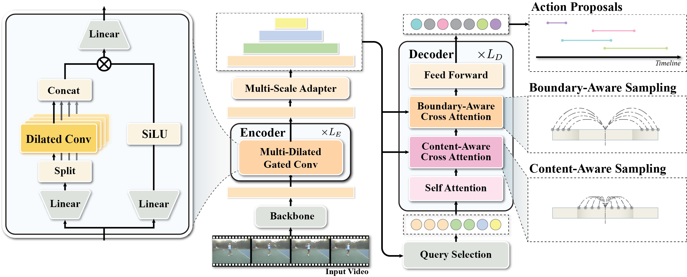

# DiGIT: Multi-Dilated Gated Encoder and Central-Adjacent Region Integrated Decoder for Temporal Action Detection Transformer

This repository contains the official implementation of the paper DiGIT: Multi-Dilated Gated Encoder and Central-Adjacent Region Integrated Decoder for Temporal Action Detection Transformer.


[[paper]](https://www.arxiv.org/abs/2505.05711)
[[CVPR paper]](https://openaccess.thecvf.com/content/CVPR2025/html/Kim_DiGIT_Multi-Dilated_Gated_Encoder_and_Central-Adjacent_Region_Integrated_Decoder_for_CVPR_2025_paper.html)



Note: We have recently removed inline comments and refactored several experimental components. The current version has not been fully tested yet. We will complete testing and update the repository shortly.

## Installation

#### NMS
```bash
cd util
python setup.py install --user # build NMS
cd ..
```

#### Temporal Deformable Attention
```bash
cd models/digit/ops
python setup.py build install
cd ../../..
```

## Prepare Dataset
We follow [ActionFormer](https://github.com/happyharrycn/actionformer_release) repository and [Video Mamba Suite](https://github.com/OpenGVLab/video-mamba-suite/blob/main/video-mamba-suite/temporal-action-localization/README.md) for preparing datasets including THUMOS14, ActivityNet v1.3, and HACS-Segment.

Use `scripts/make_feature_info.py` to generate feature information for each dataset.
THUMOS14 is already prepared in the repository.


## Training
To train the DiGIT model on the THUMOS14 dataset, execute the following command:
```bash
python main.py --c config/digit/internvideo2/thumos14.py --output_dir logs/thumos14
```
## Evaluation
To evaluate the trained model and obtain performance metrics, use the following command structure:
```bash
python main.py --eval --c config/digit/internvideo2/thumos14.py --output_dir logs/thumos14
```


## Citation
if you find our work helpful, please consider citing our paper:
```
@InProceedings{Kim_2025_CVPR,
    author    = {Kim, Ho-Joong and Lee, Yearang and Hong, Jung-Ho and Lee, Seong-Whan},
    title     = {DiGIT: Multi-Dilated Gated Encoder and Central-Adjacent Region Integrated Decoder for Temporal Action Detection Transformer},
    booktitle = {Proceedings of the Computer Vision and Pattern Recognition Conference (CVPR)},
    month     = {June},
    year      = {2025},
    pages     = {24286-24296}
}
```